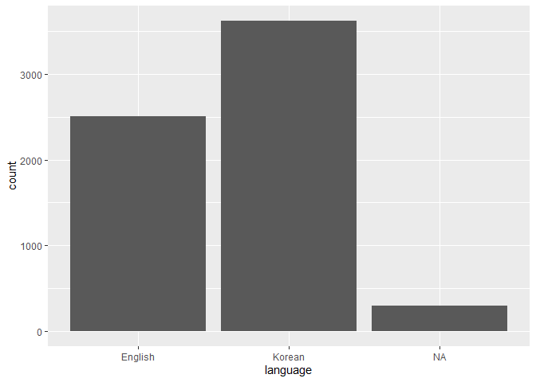
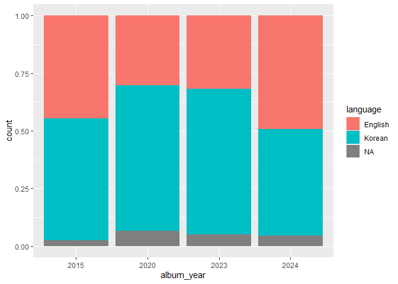
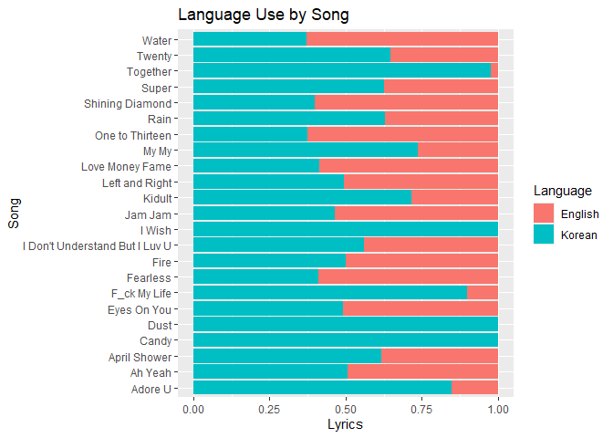
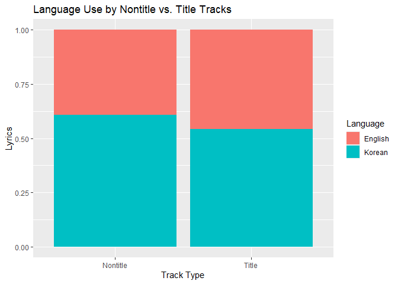
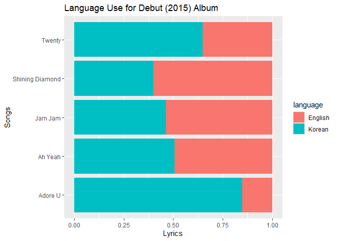
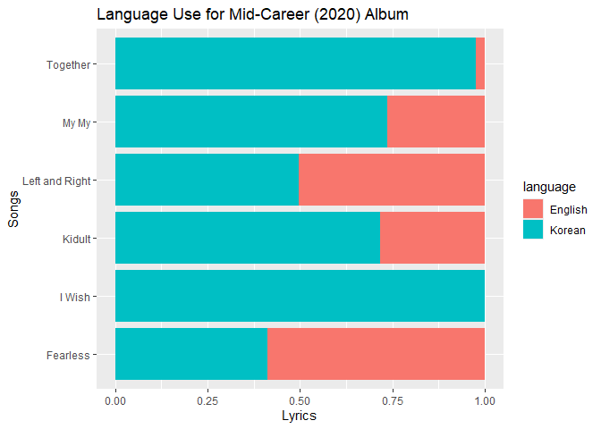
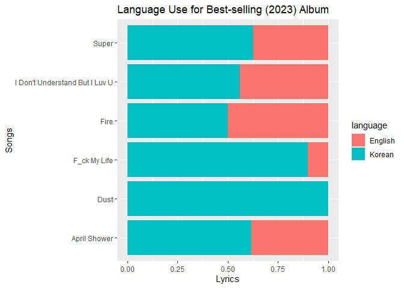
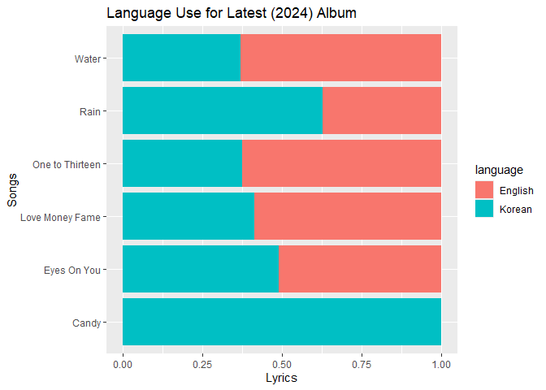

## Reading in the Data

The code below shows the code I used to read in the data, where each
song is its own csv file. I then created columns for the metadata
associated with each song.

``` r
#reading in packages I will need
library(tidyverse)
```

    ── Attaching core tidyverse packages ──────────────────────── tidyverse 2.0.0 ──
    ✔ dplyr     1.1.4     ✔ readr     2.1.5
    ✔ forcats   1.0.0     ✔ stringr   1.5.1
    ✔ ggplot2   3.5.2     ✔ tibble    3.3.0
    ✔ lubridate 1.9.4     ✔ tidyr     1.3.1
    ✔ purrr     1.1.0     
    ── Conflicts ────────────────────────────────────────── tidyverse_conflicts() ──
    ✖ dplyr::filter() masks stats::filter()
    ✖ dplyr::lag()    masks stats::lag()
    ℹ Use the conflicted package (<http://conflicted.r-lib.org/>) to force all conflicts to become errors

``` r
library(dplyr)
library(stringr)
library(tidytext)

#reading multiple files of data into R and replacing NA's to present as true NA's
firstfiles <- list.files(pattern=".csv") |>
  read_csv(id = "file", na = c("", "na", "n/a", "N/A", "NA", "Na"))
```

    Rows: 1582 Columns: 2
    ── Column specification ────────────────────────────────────────────────────────
    Delimiter: ","
    chr (1): Lyrics

    ℹ Use `spec()` to retrieve the full column specification for this data.
    ℹ Specify the column types or set `show_col_types = FALSE` to quiet this message.

``` r
# Putting each song's metadata in separate columns
firstfiles$track_type = str_extract(firstfiles$file, "Title|Nontitle")
firstfiles$album_year = str_extract(firstfiles$file, "15|20|23|24")
 colnames(firstfiles) <- tolower(colnames(firstfiles))
#separating out song name using stringr function + mutate:
lyrics = firstfiles |>
  mutate(
    file = as.character(file),
  song_title = case_when(
    str_detect(file, "Nontitle_Ah_Yeah_15.csv") ~ "Ah Yeah",
    str_detect(file, "Nontitle_April_shower_23.csv") ~ "April Shower",
    str_detect(file, "Nontitle_Candy_24.csv") ~ "Candy",
    str_detect(file, "Nontitle_Dust_23.csv") ~ "Dust",
    str_detect(file, "Nontitle_Eyes_On_You_24.csv") ~ "Eyes On You",
    str_detect(file, "Nontitle_F_ck_My_Life_23.csv") ~ "F_ck My Life",
    str_detect(file, "Nontitle_Fearless_20.csv") ~ "Fearless",
    str_detect(file, "Nontitle_Fire_23.csv") ~ "Fire",
    str_detect(file, "Nontitle_I_Dont_Understand_But_I_Luv_U_23.csv") ~ "I Don't Understand But I Luv U",
    str_detect(file, "Nontitle_I_Wish_20.csv") ~ "I Wish",
    str_detect(file, "Nontitle_Jam_Jam_15.csv") ~ "Jam Jam",
    str_detect(file, "Nontitle_Kidult_20.csv") ~ "Kidult",
    str_detect(file, "Nontitle_My_My_20.csv") ~ "My My",
    str_detect(file, "Nontitle_Rain_24.csv") ~ "Rain",
    str_detect(file, "Nontitle_Shining_Diamond_15.csv") ~ "Shining Diamond",
    str_detect(file, "Nontitle_Together_20.csv") ~ "Together",
    str_detect(file, "Nontitle_Twenty_15.csv") ~ "Twenty",
    str_detect(file, "Nontitle_Water_24.csv") ~ "Water",
    str_detect(file, "Title_Adore_U_15.csv") ~ "Adore U",
    str_detect(file, "Title_Left_and_Right_20.csv") ~ "Left and Right",
    str_detect(file, "Title_Love_Money_Fame_24.csv") ~ "Love Money Fame",
    str_detect(file, "Title_One_to_Thirteen_24.csv") ~ "One to Thirteen",
    str_detect(file, "Title_Super_23.csv") ~ "Super"),
  album_year = case_when(
    str_detect(album_year, "24") ~ "2024",
    str_detect(album_year, "23") ~ "2023",
    str_detect(album_year, "20") ~ "2020",
    str_detect(album_year, "15") ~ "2015")
  ) ->> lyrics

print(lyrics)
```

    # A tibble: 1,582 × 5
       file                    lyrics               track_type album_year song_title
       <chr>                   <chr>                <chr>      <chr>      <chr>     
     1 Nontitle_Ah_Yeah_15.csv 아 예 아 예 근데 뭐라구요?…… Nontitle   2015       Ah Yeah   
     2 Nontitle_Ah_Yeah_15.csv Yo $. Coup$, Here’s… Nontitle   2015       Ah Yeah   
     3 Nontitle_Ah_Yeah_15.csv 등장과 동시에 들러리들 바닥에서…… Nontitle   2015       Ah Yeah   
     4 Nontitle_Ah_Yeah_15.csv 침 흘리며 기절 그 위에서 수영해요… Nontitle   2015       Ah Yeah   
     5 Nontitle_Ah_Yeah_15.csv WOAH 옆구리 지방튜브 끼고 못 … Nontitle   2015       Ah Yeah   
     6 Nontitle_Ah_Yeah_15.csv 애들이 알리 있나     Nontitle   2015       Ah Yeah   
     7 Nontitle_Ah_Yeah_15.csv 못 뜬 이유 절대 모름 (Don’t… Nontitle   2015       Ah Yeah   
     8 Nontitle_Ah_Yeah_15.csv 맞출 생각 없어       Nontitle   2015       Ah Yeah   
     9 Nontitle_Ah_Yeah_15.csv 니 식견에 날 맞추지 말길…… Nontitle   2015       Ah Yeah   
    10 Nontitle_Ah_Yeah_15.csv 막 귀들 방구석 박혀 밖에 나오질 … Nontitle   2015       Ah Yeah   
    # ℹ 1,572 more rows

``` r
?remove()
```

    starting httpd help server ... done

## Cleaning up the Data

I used functions from tidy text to make it so that each word is its own
row. I used stringr functions to detect Hangul use versus Latin alphabet
use, which divided the individual words of the lyrics by language.

``` r
#putting each word of the lyrics as its own row and feeding it back into the dataframe
lyrics |> 
  unnest_tokens(word, "lyrics") |> arrange(desc(album_year)) -> lyrics
print(lyrics)
```

    # A tibble: 6,418 × 5
       file                  track_type album_year song_title word    
       <chr>                 <chr>      <chr>      <chr>      <chr>   
     1 Nontitle_Candy_24.csv Nontitle   2024       Candy      우리    
     2 Nontitle_Candy_24.csv Nontitle   2024       Candy      사탕    
     3 Nontitle_Candy_24.csv Nontitle   2024       Candy      같은    
     4 Nontitle_Candy_24.csv Nontitle   2024       Candy      사랑해요
     5 Nontitle_Candy_24.csv Nontitle   2024       Candy      자그만  
     6 Nontitle_Candy_24.csv Nontitle   2024       Candy      말      
     7 Nontitle_Candy_24.csv Nontitle   2024       Candy      하나에도
     8 Nontitle_Candy_24.csv Nontitle   2024       Candy      기분이  
     9 Nontitle_Candy_24.csv Nontitle   2024       Candy      좋아질  
    10 Nontitle_Candy_24.csv Nontitle   2024       Candy      수      
    # ℹ 6,408 more rows

``` r
#mutating dataframe to detect language of rows of lyrics and create language column
lyricdf <- lyrics |>
  mutate(
    word   = as.character(word),
  language = case_when(
  str_detect(word, "[가-힣]") ~ "Korean",
  str_detect(word, "[a-zA-z 12345]") ~ "English"
)) ->> lyricsdf
  
  print(lyricsdf)
```

    # A tibble: 6,418 × 6
       file                  track_type album_year song_title word     language
       <chr>                 <chr>      <chr>      <chr>      <chr>    <chr>   
     1 Nontitle_Candy_24.csv Nontitle   2024       Candy      우리     Korean  
     2 Nontitle_Candy_24.csv Nontitle   2024       Candy      사탕     Korean  
     3 Nontitle_Candy_24.csv Nontitle   2024       Candy      같은     Korean  
     4 Nontitle_Candy_24.csv Nontitle   2024       Candy      사랑해요 Korean  
     5 Nontitle_Candy_24.csv Nontitle   2024       Candy      자그만   Korean  
     6 Nontitle_Candy_24.csv Nontitle   2024       Candy      말       Korean  
     7 Nontitle_Candy_24.csv Nontitle   2024       Candy      하나에도 Korean  
     8 Nontitle_Candy_24.csv Nontitle   2024       Candy      기분이   Korean  
     9 Nontitle_Candy_24.csv Nontitle   2024       Candy      좋아질   Korean  
    10 Nontitle_Candy_24.csv Nontitle   2024       Candy      수       Korean  
    # ℹ 6,408 more rows

## Analyzing the Data

``` r
#to count the language breakdown of the lyrics overall
lyricsdf |> count(language, sort=TRUE)
```

    # A tibble: 3 × 2
      language     n
      <chr>    <int>
    1 Korean    3621
    2 English   2508
    3 <NA>       289

``` r
#...and visualize it:
ggplot(data=subset(lyricsdf, !is.na(language)), aes(x = language)) +
  geom_bar(fill = "salmon")+ theme_light() + xlab("Language") + ylab("Count") + labs(title = "Overall Language Use")
```



``` r
ggsave("Overall Language Use.png")
```

    Saving 7 x 5 in image

``` r
#code meant to count the language breakdown of lyrics by album
table(lyricsdf$album_year, lyricsdf$language)
```

          
           English Korean
      2015     828    980
      2020     494   1031
      2023     476    944
      2024     710    666

``` r
#...and visualize it:
ggplot(data=subset(lyricsdf, !is.na(language)), aes(x = language, fill = album_year, na.rm = FALSE)) +
  geom_bar(position = "dodge") + xlab("Language") + ylab("Lyrics") + labs(fill = "Album Year")  + labs(title = "Language Use for Each Album Year")
```


``` r
ggsave("Language Use for Each Album Year.png")
```

    Saving 7 x 5 in image

``` r
ggplot(data=subset(lyricsdf, !is.na(language)), aes(x = album_year, fill = language)) +
  geom_bar(position = "dodge") + xlab("Album Year") + ylab("Lyrics") + labs(fill = "Language") + labs(title = "Language Comparison by Album Year")
```



``` r
ggsave("Language Comparison by Album Year.png")
```

    Saving 7 x 5 in image

``` r
#...by song:
ggplot(data=subset(lyricsdf, !is.na(language)), aes(y = song_title, fill = language)) +
  geom_bar(position = "fill") + xlab("Lyrics") + ylab("Song") + labs(fill = "Language") + labs(title = "Language Use by Song")
```



``` r
ggsave("Language Use by Song.png")
```

    Saving 7 x 5 in image

``` r
#...by title versus non-title track
ggplot(data=subset(lyricsdf, !is.na(language)), aes(x = track_type, fill = language)) +
  geom_bar(position = "fill") + xlab("Track Type") + ylab("Lyrics") + labs(fill ="Language") + labs(title = "Language Use by Nontitle vs. Title Tracks")
```



``` r
ggsave("Language Use by Nontitle vs. Title Tracks.png")
```

    Saving 7 x 5 in image

``` r
#sorting songs into albums:
filter(lyricsdf, album_year == "2024") ->> byalbum24
filter(lyricsdf, album_year == "2023") ->> byalbum23
filter(lyricsdf, album_year == "2020") ->> byalbum20
filter(lyricsdf, album_year == "2015") ->> byalbum15

#visualizing language use by album and song using objects from above ^: 
ggplot(data=subset(byalbum15, !is.na(language)), aes(y = song_title, fill = language)) +
  geom_bar(position = "fill") + xlab("Lyrics") + ylab("Songs") + labs(title= "Language Use for Debut (2015) Album")
```



``` r
ggsave("Language Use for Debut.png")
```

    Saving 7 x 5 in image

``` r
ggplot(data=subset(byalbum20, !is.na(language)), aes(y = song_title, fill = language)) +
  geom_bar(position = "fill") + xlab("Lyrics") + ylab("Songs") + labs(title= "Language Use for Mid-Career (2020) Album")
```



``` r
ggsave("Language Use for Mid-Career.png")
```

    Saving 7 x 5 in image

``` r
ggplot(data=subset(byalbum23, !is.na(language)), aes(y = song_title, fill = language)) +
  geom_bar(position = "fill") + xlab("Lyrics") + ylab("Songs") + labs(title= "Language Use for Best-selling (2023) Album")
```



``` r
ggsave("Language Use for Best-selling.png")
```

    Saving 7 x 5 in image

``` r
ggplot(data=subset(byalbum24, !is.na(language)), aes(y = song_title, fill = language)) +
  geom_bar(position = "fill") + xlab("Lyrics") + ylab("Songs") + labs(title= "Language Use for Latest (2024) Album")
```



``` r
ggsave("Language Use for Latest.png")
```

    Saving 7 x 5 in image

Session Info

``` r
sessionInfo()
```

    R version 4.5.1 (2025-06-13 ucrt)
    Platform: x86_64-w64-mingw32/x64
    Running under: Windows 10 x64 (build 19045)

    Matrix products: default
      LAPACK version 3.12.1

    locale:
    [1] LC_COLLATE=English_United States.utf8 
    [2] LC_CTYPE=English_United States.utf8   
    [3] LC_MONETARY=English_United States.utf8
    [4] LC_NUMERIC=C                          
    [5] LC_TIME=English_United States.utf8    

    time zone: America/New_York
    tzcode source: internal

    attached base packages:
    [1] stats     graphics  grDevices utils     datasets  methods   base     

    other attached packages:
     [1] tidytext_0.4.3  lubridate_1.9.4 forcats_1.0.0   stringr_1.5.1  
     [5] dplyr_1.1.4     purrr_1.1.0     readr_2.1.5     tidyr_1.3.1    
     [9] tibble_3.3.0    ggplot2_3.5.2   tidyverse_2.0.0

    loaded via a namespace (and not attached):
     [1] janeaustenr_1.0.0  utf8_1.2.6         generics_0.1.4     stringi_1.8.7     
     [5] lattice_0.22-7     hms_1.1.3          digest_0.6.37      magrittr_2.0.3    
     [9] evaluate_1.0.5     grid_4.5.1         timechange_0.3.0   RColorBrewer_1.1-3
    [13] fastmap_1.2.0      jsonlite_2.0.0     Matrix_1.7-3       scales_1.4.0      
    [17] textshaping_1.0.1  cli_3.6.5          rlang_1.1.6        crayon_1.5.3      
    [21] tokenizers_0.3.0   bit64_4.6.0-1      withr_3.0.2        yaml_2.3.10       
    [25] tools_4.5.1        parallel_4.5.1     tzdb_0.5.0         vctrs_0.6.5       
    [29] R6_2.6.1           lifecycle_1.0.4    bit_4.6.0          vroom_1.6.5       
    [33] ragg_1.4.0         pkgconfig_2.0.3    pillar_1.11.0      gtable_0.3.6      
    [37] glue_1.8.0         Rcpp_1.1.0         systemfonts_1.2.3  xfun_0.52         
    [41] tidyselect_1.2.1   rstudioapi_0.17.1  knitr_1.50         farver_2.1.2      
    [45] htmltools_0.5.8.1  SnowballC_0.7.1    labeling_0.4.3     rmarkdown_2.30    
    [49] compiler_4.5.1    
